# ERD Lengkap Aplikasi JimCapasitor

Dokumen ini menyusun ERD konseptual lengkap untuk seluruh fitur aplikasi berdasarkan struktur route, komponen, dan data mock yang ada di codebase.

Catatan:
- Aplikasi saat ini masih banyak memakai mock data di frontend.
- Karena belum ada backend/database nyata, beberapa tabel di bawah adalah hasil inferensi desain data yang paling masuk akal dari fitur yang sudah ada.
- ERD ini disusun agar siap dipakai sebagai dasar implementasi backend relasional.

## Cakupan Modul

- Auth, session, install, dan preferensi aplikasi
- Profil user, friendship, circle, presence, lokasi
- Chat dan message
- Daily check-in mood dan response
- Activity, category, participant, kebutuhan, opsi/poll
- Friend quiz, jawaban, dan point
- Challenge/poll cepat
- Memory board, timeline, inside joke
- Statistik, ranking, suggestion
- Wallet sederhana, transaksi, group purchase, dan recommendation di Home

## Mermaid ERD

```mermaid
erDiagram
    USER {
        uuid id PK
        string username
        string display_name
        string email
        string password_hash
        string auth_provider
        string google_sub
        int age
        string gender
        string bio
        string avatar_initial
        string avatar_tone
        string avatar_image_url
        boolean is_active
        datetime created_at
        datetime updated_at
    }

    USER_HOBBY {
        uuid id PK
        uuid user_id FK
        string hobby_name
        datetime created_at
    }

    AUTH_SESSION {
        uuid id PK
        uuid user_id FK
        string provider
        string access_token
        string refresh_token
        datetime expires_at
        string login_type
        datetime created_at
    }

    APP_INSTALLATION {
        uuid id PK
        uuid user_id FK
        string platform
        string install_source
        boolean is_standalone
        datetime installed_at
        datetime last_opened_at
    }

    APP_SETTING {
        uuid id PK
        uuid user_id FK
        string setting_key
        string setting_value
        datetime updated_at
    }

    FRIENDSHIP {
        uuid id PK
        uuid user_id FK
        uuid friend_user_id FK
        string status
        string closeness_level
        datetime created_at
        datetime updated_at
    }

    CIRCLE {
        uuid id PK
        string slug
        string title
        string emoji
        string accent_style
        string privacy_type
        uuid owner_user_id FK
        datetime created_at
    }

    CIRCLE_MEMBER {
        uuid id PK
        uuid circle_id FK
        uuid user_id FK
        string role
        boolean is_active_member
        datetime joined_at
    }

    USER_PRESENCE {
        uuid id PK
        uuid user_id FK
        string online_status
        string custom_status
        string activity_label
        datetime last_seen_at
        datetime updated_at
    }

    USER_LOCATION_PING {
        uuid id PK
        uuid user_id FK
        decimal latitude
        decimal longitude
        string place_label
        string area_label
        decimal distance_km
        datetime recorded_at
    }

    DAILY_MOOD {
        uuid id PK
        uuid user_id FK
        date mood_date
        string mood_code
        string mood_label
        string emoji
        datetime created_at
    }

    MOOD_RESPONSE {
        uuid id PK
        uuid mood_id FK
        uuid sender_user_id FK
        string response_type
        string message
        datetime created_at
    }

    CHAT_THREAD {
        uuid id PK
        string thread_type
        string title
        uuid created_by FK
        uuid circle_id FK
        datetime created_at
        datetime updated_at
    }

    CHAT_THREAD_MEMBER {
        uuid id PK
        uuid thread_id FK
        uuid user_id FK
        string member_role
        boolean is_muted
        boolean is_archived
        datetime joined_at
    }

    CHAT_MESSAGE {
        uuid id PK
        uuid thread_id FK
        uuid sender_user_id FK
        string message_type
        text message_text
        string attachment_url
        datetime sent_at
        datetime read_at
    }

    ACTIVITY_TYPE {
        uuid id PK
        string code
        string title
        string short_label
        string emoji
        string accent_style
        string description
    }

    ACTIVITY_CATEGORY {
        uuid id PK
        uuid activity_type_id FK
        string category_name
        boolean is_system
        datetime created_at
    }

    ACTIVITY {
        uuid id PK
        uuid activity_type_id FK
        uuid activity_category_id FK
        uuid creator_user_id FK
        uuid circle_id FK
        string title
        text description
        string activity_status
        datetime start_at
        string time_label
        string location_label
        string cta_label
        datetime created_at
        datetime updated_at
    }

    ACTIVITY_PARTICIPANT {
        uuid id PK
        uuid activity_id FK
        uuid user_id FK
        string participant_role
        string join_status
        datetime joined_at
    }

    ACTIVITY_NEED {
        uuid id PK
        uuid activity_id FK
        string need_name
        boolean is_ready
        string status_label
        uuid supplied_by_user_id FK
        datetime updated_at
    }

    ACTIVITY_OPTION {
        uuid id PK
        uuid activity_id FK
        string option_label
        string option_type
        boolean is_default
        datetime created_at
    }

    FRIEND_QUIZ {
        uuid id PK
        uuid owner_user_id FK
        uuid circle_id FK
        string title
        string quiz_status
        datetime created_at
    }

    FRIEND_QUIZ_QUESTION {
        uuid id PK
        uuid quiz_id FK
        string question_text
        string description
        int point_reward
        int sort_order
        datetime created_at
    }

    FRIEND_QUIZ_OPTION {
        uuid id PK
        uuid question_id FK
        string option_label
        boolean is_correct
        int sort_order
    }

    FRIEND_QUIZ_ANSWER {
        uuid id PK
        uuid question_id FK
        uuid respondent_user_id FK
        uuid selected_option_id FK
        boolean is_correct
        int points_earned
        datetime answered_at
    }

    MINI_CHALLENGE {
        uuid id PK
        uuid circle_id FK
        uuid creator_user_id FK
        string challenge_type
        string title
        text description
        string challenge_status
        datetime created_at
    }

    MINI_CHALLENGE_PARTICIPANT {
        uuid id PK
        uuid challenge_id FK
        uuid user_id FK
        string participant_status
        int score
        datetime joined_at
    }

    POLL {
        uuid id PK
        uuid challenge_id FK
        uuid activity_id FK
        string title
        string poll_status
        datetime created_at
    }

    POLL_OPTION {
        uuid id PK
        uuid poll_id FK
        string option_label
        uuid target_user_id FK
        int vote_count_cached
    }

    POLL_VOTE {
        uuid id PK
        uuid poll_option_id FK
        uuid voter_user_id FK
        datetime voted_at
    }

    MEMORY_BOARD {
        uuid id PK
        uuid owner_user_id FK
        string board_type
        string title
        string description
        datetime created_at
    }

    MEMORY_ENTRY {
        uuid id PK
        uuid board_id FK
        uuid author_user_id FK
        string entry_type
        string title
        text content
        string note
        datetime memory_at
        datetime created_at
    }

    MEMORY_PARTICIPANT {
        uuid id PK
        uuid memory_entry_id FK
        uuid user_id FK
        string role_label
    }

    MEMORY_MEDIA {
        uuid id PK
        uuid memory_entry_id FK
        string media_type
        string media_url
        string emoji_art
        string caption
        datetime taken_at
    }

    FRIENDSHIP_TIMELINE {
        uuid id PK
        uuid owner_user_id FK
        uuid friend_user_id FK
        string title
        text detail
        date event_date
        datetime created_at
    }

    INSIDE_JOKE_BOARD {
        uuid id PK
        uuid circle_id FK
        string board_type
        string title
        string description
        datetime created_at
    }

    INSIDE_JOKE_ITEM {
        uuid id PK
        uuid board_id FK
        uuid sender_user_id FK
        string item_type
        string title
        text caption
        string media_url
        string emoji_art
        datetime sent_at
        int saved_count
    }

    FRIEND_STAT_SNAPSHOT {
        uuid id PK
        uuid owner_user_id FK
        uuid friend_user_id FK
        string period_type
        date period_start
        date period_end
        int chat_count
        int meet_count
        int play_count
        int challenge_count
        int friendship_level
        datetime generated_at
    }

    SMART_SUGGESTION {
        uuid id PK
        uuid user_id FK
        string suggestion_type
        string title
        string prompt
        text detail
        string action_label
        string status
        datetime generated_at
    }

    SMART_SUGGESTION_TARGET {
        uuid id PK
        uuid suggestion_id FK
        uuid target_user_id FK
        uuid target_circle_id FK
    }

    WALLET_ACCOUNT {
        uuid id PK
        uuid user_id FK
        string wallet_type
        decimal balance_amount
        string currency_code
        datetime updated_at
    }

    WALLET_TRANSACTION {
        uuid id PK
        uuid wallet_account_id FK
        string transaction_type
        decimal amount
        string title
        text description
        string status
        datetime transaction_at
    }

    GROUP_PURCHASE {
        uuid id PK
        uuid creator_user_id FK
        string title
        text description
        string location_label
        decimal unit_price
        string unit_name
        decimal rating
        string cover_image_url
        string status
        datetime created_at
    }

    GROUP_PURCHASE_MEMBER {
        uuid id PK
        uuid group_purchase_id FK
        uuid user_id FK
        int quantity
        decimal contribution_amount
        string member_status
        datetime joined_at
    }

    COMMUNITY_RECOMMENDATION {
        uuid id PK
        uuid author_user_id FK
        string title
        string category_tag
        decimal rating
        string cover_image_url
        text description
        datetime created_at
    }

    USER ||--o{ USER_HOBBY : has
    USER ||--o{ AUTH_SESSION : logs_in
    USER ||--o{ APP_INSTALLATION : installs
    USER ||--o{ APP_SETTING : owns
    USER ||--o{ FRIENDSHIP : initiates
    USER ||--o{ FRIENDSHIP : receives
    USER ||--o{ CIRCLE : creates
    CIRCLE ||--o{ CIRCLE_MEMBER : contains
    USER ||--o{ CIRCLE_MEMBER : joins
    USER ||--o{ USER_PRESENCE : updates
    USER ||--o{ USER_LOCATION_PING : shares
    USER ||--o{ DAILY_MOOD : posts
    DAILY_MOOD ||--o{ MOOD_RESPONSE : gets
    USER ||--o{ MOOD_RESPONSE : sends
    CIRCLE ||--o{ CHAT_THREAD : scopes
    USER ||--o{ CHAT_THREAD : creates
    CHAT_THREAD ||--o{ CHAT_THREAD_MEMBER : has
    USER ||--o{ CHAT_THREAD_MEMBER : participates
    CHAT_THREAD ||--o{ CHAT_MESSAGE : contains
    USER ||--o{ CHAT_MESSAGE : sends
    ACTIVITY_TYPE ||--o{ ACTIVITY_CATEGORY : groups
    ACTIVITY_TYPE ||--o{ ACTIVITY : classifies
    ACTIVITY_CATEGORY ||--o{ ACTIVITY : categorizes
    USER ||--o{ ACTIVITY : creates
    CIRCLE ||--o{ ACTIVITY : scopes
    ACTIVITY ||--o{ ACTIVITY_PARTICIPANT : includes
    USER ||--o{ ACTIVITY_PARTICIPANT : joins
    ACTIVITY ||--o{ ACTIVITY_NEED : requires
    USER ||--o{ ACTIVITY_NEED : supplies
    ACTIVITY ||--o{ ACTIVITY_OPTION : offers
    USER ||--o{ FRIEND_QUIZ : owns
    CIRCLE ||--o{ FRIEND_QUIZ : targets
    FRIEND_QUIZ ||--o{ FRIEND_QUIZ_QUESTION : contains
    FRIEND_QUIZ_QUESTION ||--o{ FRIEND_QUIZ_OPTION : has
    FRIEND_QUIZ_QUESTION ||--o{ FRIEND_QUIZ_ANSWER : gets
    USER ||--o{ FRIEND_QUIZ_ANSWER : answers
    FRIEND_QUIZ_OPTION ||--o{ FRIEND_QUIZ_ANSWER : selected_in
    CIRCLE ||--o{ MINI_CHALLENGE : has
    USER ||--o{ MINI_CHALLENGE : creates
    MINI_CHALLENGE ||--o{ MINI_CHALLENGE_PARTICIPANT : includes
    USER ||--o{ MINI_CHALLENGE_PARTICIPANT : joins
    MINI_CHALLENGE ||--o| POLL : may_open
    ACTIVITY ||--o| POLL : may_open
    POLL ||--o{ POLL_OPTION : provides
    POLL_OPTION ||--o{ POLL_VOTE : receives
    USER ||--o{ POLL_VOTE : casts
    USER ||--o{ POLL_OPTION : represents
    USER ||--o{ MEMORY_BOARD : owns
    MEMORY_BOARD ||--o{ MEMORY_ENTRY : stores
    USER ||--o{ MEMORY_ENTRY : writes
    MEMORY_ENTRY ||--o{ MEMORY_PARTICIPANT : mentions
    USER ||--o{ MEMORY_PARTICIPANT : appears_in
    MEMORY_ENTRY ||--o{ MEMORY_MEDIA : attaches
    USER ||--o{ FRIENDSHIP_TIMELINE : owns
    USER ||--o{ FRIENDSHIP_TIMELINE : references
    CIRCLE ||--o{ INSIDE_JOKE_BOARD : owns
    INSIDE_JOKE_BOARD ||--o{ INSIDE_JOKE_ITEM : stores
    USER ||--o{ INSIDE_JOKE_ITEM : sends
    USER ||--o{ FRIEND_STAT_SNAPSHOT : owns
    USER ||--o{ FRIEND_STAT_SNAPSHOT : evaluates
    USER ||--o{ SMART_SUGGESTION : receives
    SMART_SUGGESTION ||--o{ SMART_SUGGESTION_TARGET : links
    USER ||--o{ SMART_SUGGESTION_TARGET : targets
    CIRCLE ||--o{ SMART_SUGGESTION_TARGET : targets
    USER ||--|| WALLET_ACCOUNT : owns
    WALLET_ACCOUNT ||--o{ WALLET_TRANSACTION : records
    USER ||--o{ GROUP_PURCHASE : creates
    GROUP_PURCHASE ||--o{ GROUP_PURCHASE_MEMBER : has
    USER ||--o{ GROUP_PURCHASE_MEMBER : joins
    USER ||--o{ COMMUNITY_RECOMMENDATION : writes
```

## Entitas Inti yang Paling Penting

### 1. Sosial Inti

- `USER`: master data semua pengguna, termasuk current user dan teman.
- `FRIENDSHIP`: hubungan dua user.
- `CIRCLE` dan `CIRCLE_MEMBER`: representasi squad seperti `Best Friend`, `School Friend`, `Game Friend`, `Secret Circle`.

### 2. Interaksi Harian

- `CHAT_THREAD`, `CHAT_THREAD_MEMBER`, `CHAT_MESSAGE`: mendukung daftar chat dan detail percakapan.
- `DAILY_MOOD` dan `MOOD_RESPONSE`: mendukung Daily Check-in dan respon seperti kirim sticker/semangat.
- `USER_PRESENCE` dan `USER_LOCATION_PING`: mendukung Today Friends, Friend Radar, dan activity suggestion berbasis online/lokasi.

### 3. Aktivitas

- `ACTIVITY_TYPE`: 6 tipe utama seperti school-task, project-group, study-help, hangout-meet, need-request, fun-challenge.
- `ACTIVITY_CATEGORY`: kategori di bawah tipe activity.
- `ACTIVITY`: record aktivitas utama.
- `ACTIVITY_PARTICIPANT`: siapa saja yang ikut.
- `ACTIVITY_NEED`: daftar kebutuhan seperti kalkulator, karton, buku, dll.
- `ACTIVITY_OPTION`: opsi tindakan atau opsi poll dalam activity.

### 4. Game Sosial

- `FRIEND_QUIZ`, `FRIEND_QUIZ_QUESTION`, `FRIEND_QUIZ_OPTION`, `FRIEND_QUIZ_ANSWER`
- `MINI_CHALLENGE`, `POLL`, `POLL_OPTION`, `POLL_VOTE`

### 5. Memory & Humor

- `MEMORY_BOARD`, `MEMORY_ENTRY`, `MEMORY_MEDIA`, `MEMORY_PARTICIPANT`
- `FRIENDSHIP_TIMELINE`
- `INSIDE_JOKE_BOARD`, `INSIDE_JOKE_ITEM`

### 6. Ringkasan & Home

- `FRIEND_STAT_SNAPSHOT`: basis Friend Stats dan Ranking.
- `SMART_SUGGESTION`: basis rekomendasi otomatis.
- `WALLET_ACCOUNT`, `WALLET_TRANSACTION`: basis saldo dan riwayat.
- `GROUP_PURCHASE`, `GROUP_PURCHASE_MEMBER`: basis kartu "Titip Yuk".
- `COMMUNITY_RECOMMENDATION`: basis kartu rekomendasi komunitas.

## Mapping Fitur ke Tabel

- `Login / Install / Entry`: `AUTH_SESSION`, `APP_INSTALLATION`
- `Settings`: `APP_SETTING`
- `User Profile`: `USER`, `USER_HOBBY`, `FRIENDSHIP_TIMELINE`
- `Circle`: `CIRCLE`, `CIRCLE_MEMBER`
- `Chat`: `CHAT_THREAD`, `CHAT_THREAD_MEMBER`, `CHAT_MESSAGE`
- `Daily Check-in`: `DAILY_MOOD`, `MOOD_RESPONSE`
- `Today Friends`: `USER_PRESENCE`, `DAILY_MOOD`, `FRIENDSHIP`, `CIRCLE_MEMBER`
- `Friend Radar`: `USER_LOCATION_PING`, `USER_PRESENCE`
- `Activity`: `ACTIVITY_TYPE`, `ACTIVITY_CATEGORY`, `ACTIVITY`, `ACTIVITY_PARTICIPANT`, `ACTIVITY_NEED`, `ACTIVITY_OPTION`
- `Friend Quiz`: `FRIEND_QUIZ*`
- `Mini Challenge`: `MINI_CHALLENGE`, `POLL*`
- `Memory`: `MEMORY_*`, `FRIENDSHIP_TIMELINE`
- `Inside Joke`: `INSIDE_JOKE_*`
- `Friend Stats / Ranking`: `FRIEND_STAT_SNAPSHOT`
- `Activity Suggestion`: `SMART_SUGGESTION`, `SMART_SUGGESTION_TARGET`
- `Home`: `WALLET_*`, `GROUP_PURCHASE*`, `COMMUNITY_RECOMMENDATION`

## Prioritas Implementasi Database

Kalau mau mulai dari versi backend yang realistis, urutan implementasinya paling aman:

1. `USER`, `AUTH_SESSION`, `APP_SETTING`
2. `FRIENDSHIP`, `CIRCLE`, `CIRCLE_MEMBER`
3. `CHAT_THREAD`, `CHAT_THREAD_MEMBER`, `CHAT_MESSAGE`
4. `DAILY_MOOD`, `USER_PRESENCE`, `USER_LOCATION_PING`
5. `ACTIVITY_TYPE`, `ACTIVITY_CATEGORY`, `ACTIVITY`, `ACTIVITY_PARTICIPANT`, `ACTIVITY_NEED`
6. `FRIEND_QUIZ*`, `MINI_CHALLENGE*`, `POLL*`
7. `MEMORY_*`, `INSIDE_JOKE_*`, `FRIEND_STAT_SNAPSHOT`, `SMART_SUGGESTION`
8. `WALLET_*`, `GROUP_PURCHASE*`, `COMMUNITY_RECOMMENDATION`

## Catatan Desain

- `FRIENDSHIP` sebaiknya pakai constraint unik untuk pasangan user agar tidak duplikat.
- `CIRCLE_MEMBER` sebaiknya pakai unique `(circle_id, user_id)`.
- `CHAT_THREAD_MEMBER` dan `ACTIVITY_PARTICIPANT` juga sebaiknya pakai unique komposit.
- `POLL_VOTE` bisa dibatasi satu vote per user per poll, tergantung aturan bisnis.
- `FRIEND_STAT_SNAPSHOT` lebih cocok sebagai tabel agregasi periodik daripada data transaksi mentah.
- `SMART_SUGGESTION` bisa dibangkitkan dari job/background worker berdasarkan presence, lokasi, dan histori interaksi.

