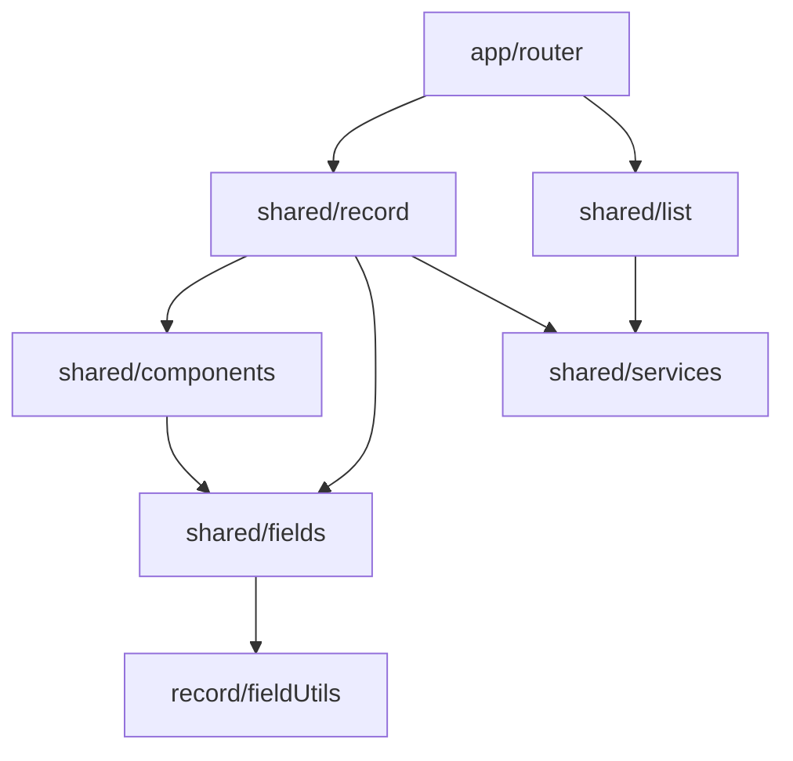

# Shared Architecture

Struktur `src/shared` sekarang dibagi menjadi beberapa area yang punya tanggung jawab jelas.

## Ringkasan

- `src/shared/record`
  Mesin record/detail/form berbasis metadata Salesforce UI API.
- `src/shared/list`
  Generic list view dan hook list data.
- `src/shared/fields`
  Renderer field edit dan view-only.
- `src/shared/components`
  Shared UI umum yang tidak khusus ke record/list engine.

## Dependency Map



Makna praktis:

- `record` adalah layer orchestration untuk detail/create/edit record.
- `list` fokus ke list data dan navigasi ke record detail.
- `fields` fokus ke rendering nilai field, bukan ke lifecycle record.
- `components` berisi shared UI ringan yang dipakai oleh layer lain.
- `services` adalah boundary ke Salesforce API.

## Dependency Rules

- `app` boleh mengimpor dari barrel `record`, `list`, dan komponen umum.
- `record` boleh mengimpor `components`, `fields`, `services`, dan util internal `record`.
- `list` boleh mengimpor `services` dan util internal `list`.
- `fields` sebaiknya tetap ringan dan hanya mengimpor helper field atau metadata resolver yang benar-benar perlu.
- `components` sebaiknya tidak mengimpor `record` atau `list` engine penuh.
- `services` harus tetap bebas dari dependency ke `record`, `list`, `fields`, atau `components`.

## Record Layer

Folder `src/shared/record` sengaja disusun mendekati pola `recordForm`, `recordViewForm`, `recordEditForm`, `fieldUtils`, dan `fieldDependencyManager`.

- `recordForm/RecordPage.jsx`
  Entry page untuk detail/create record.
- `recordForm/RecordForm.jsx`
  Renderer section dan item untuk mode edit/create.
- `recordViewForm/RecordViewForm.jsx`
  Wrapper view-only dengan preview section.
- `recordEditForm/useRecordForm.js`
  Hook engine utama: load record, create defaults, dirty state, save, create, delete, lookup, dan picklist.
- `recordEditForm/hzRecordUi.js`
  Mapper UI API ke layout model internal.
- `recordEditUtils/recordEditUtils.js`
  Utility validasi, field error, dan merge state.
- `fieldUtils/fieldUtils.js`
  Resolver metadata field, compound field, label, dan display value.
- `fieldDependencyManager/fieldDependencyManager.js`
  Logic dependent picklist / controller field.
- `recordSectionUtils/recordSectionUtils.js`
  Helper preview section dan transform item per section.

Public entry point:

- `src/shared/record/index.js`

## List Layer

Folder `src/shared/list` dipakai untuk list engine yang lebih kecil tapi pola tanggung jawabnya tetap konsisten.

- `ListView.jsx`
  Page list object.
- `useListView.js`
  Hook data list.
- `listViewUtils.js`
  Query builder, title resolver, dan card mapper.

Public entry point:

- `src/shared/list/index.js`

## Field Layer

Folder `src/shared/fields` dipakai untuk renderer field agar input dan output tetap terpisah.

- `inputField/InputField.jsx`
  Renderer edit mode.
- `outputField/OutputField.jsx`
  Renderer view mode.
- `fieldShared/fieldShared.js`
  Shared formatter dan resolver value.

Public entry point:

- `src/shared/fields/index.js`

## Naming

Nama publik sekarang memakai bentuk generik:

- `RecordPage`
- `RecordForm`
- `RecordViewForm`
- `useRecordForm`
- `ListView`
- `useListView`
- `InputField`
- `OutputField`
- `Field`
- `RecordItem`

Prefix `Hz` sudah tidak dipakai lagi di `src`.

## Praktik Import

Gunakan barrel utama bila mengimpor dari luar area:

```js
import { RecordPage } from '@/shared/record'
import { ListView } from '@/shared/list'
import { InputField, OutputField } from '@/shared/fields'
```

Gunakan import langsung ke file atau subfolder index bila berada di area yang sama dan ingin menghindari dependency graph yang terlalu lebar.
